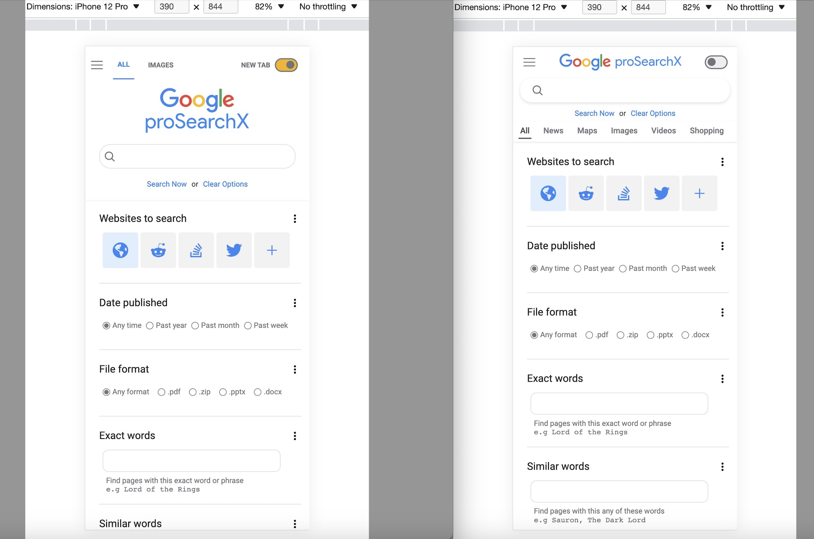
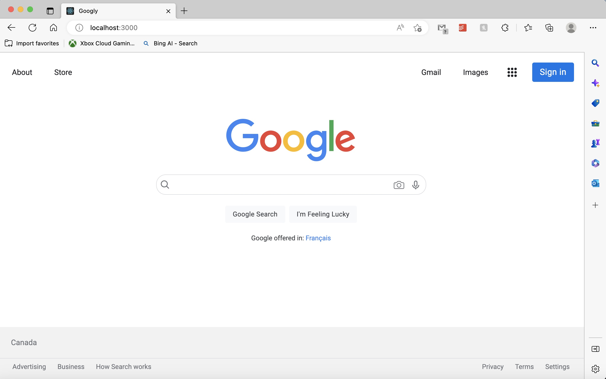
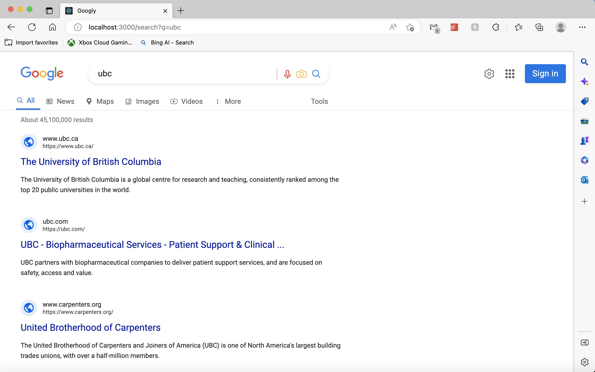

<h1 align="center">Google ProSearchX</h1>

This is a fork of my Google search clone project ([Googly](https://github.com/mathewbushuru/googly)) but with additional features and enhancements to make Google Search more effective and powerful. 

It is designed for power users and professionals who require an easier and faster way to unlock Google's search capabilities. If you're like me and are tired of typing 'reddit' or 'stackoverflow' everytime on Google, then this would make a good replacement for your browser's homepage or new tab.

The React app is hosted using Vercel. Visit the app at [pro-search-x.vercel.app](https://pro-search-x.vercel.app/)

This project follows the structure of my react-starter-kit which is documented at `./docs/README.md`

##### Project structure

- [💻 Application Overview](./docs/README.md)
- [⚙️ Project Configuration](./docs/README.md)
- [🗄️ Project Structure](./docs/README.md)
- [🧱 Components And Styling](./docs/README.md)
- [📡 API Layer](./docs/README.md)
- [🗃️ State Management](./docs/README.md)
- [🧪 Testing](./docs/README.md)
- [⚠️ Error Handling](./docs/README.md)
- [🌐 Deployment](docs/deployment.md)

##### Features

- Only search specific websites.
- Only return results from a specific timeframe
- Choose file format of expected results.
- exclude false positives
- A mobile-first design approach and a fully responsive implementation. As shown in the photos below, the app is styled to be usable at different screen sizes.

##### Progress Images

 
 
 

