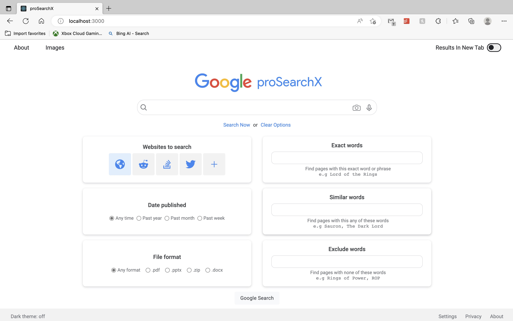

# Googly

A Google Search(UI) Clone

Visit the app [here](https://googly-lovat.vercel.app/)

The structure of  this project is documented at [docs/README.md](./docs/README.md)

This is a fully responsive UI implementation of Google search built with ReactJS and styled with custom CSS.

The app has these features:
- Global error handling: Any uncaught or unhandled error does not break the app, instead a nice message is shown to the user before they are redirected.

### Backend 

At the moment, I plan to use an API that scrapes Google's website to provide search results in this app.

### Deployment

This project is hosted on [Vercel](https://googly-lovat.vercel.app/)

 
 

